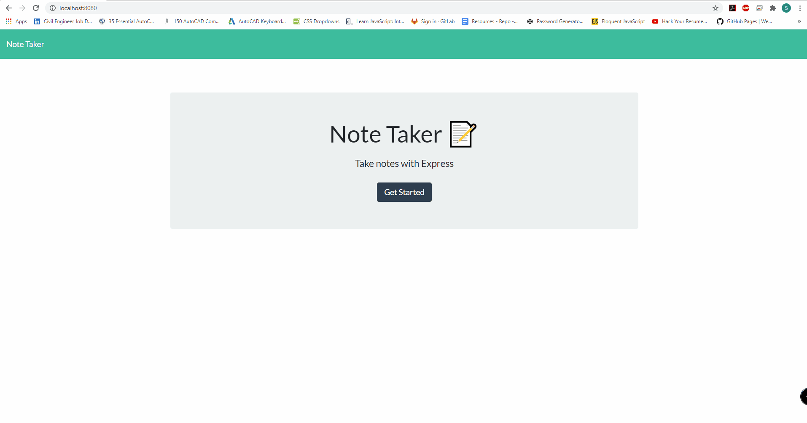
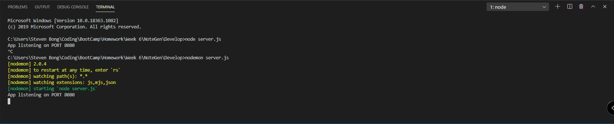
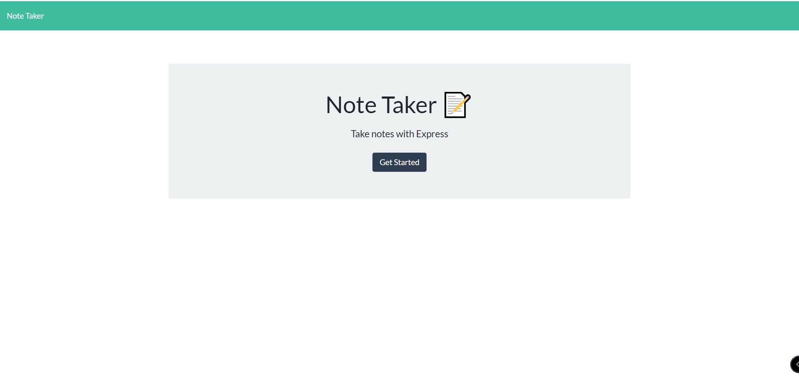

# Team Profile Generator

## Description 
The objective of this application is to ease the user in taking notes for their own purposes. The note taker is a very friendly generator for users to take any notes and stored them in the storage even though after it refreshes. The note taker generator also can add as many as the user wants to add, delete notes if there is any notes that have been existed, and show the notes whenever the user wants to load the notes.  
    
## Table of Contents
* [Installation](#installation)
* [Usage](#usage)
* [Credits](#credits)
* [License](#license)

## Installation 
This application requires few installation to made, which are the express and path. Both are really crucial due to the attachment of this generator to back-end things to make them easier to build. To install both packages, the steps will be explained by screenshot listed as below:
 
  
## Usage 
If there is any confusion in using this application, then users can utitlize the video on this repository. This generator has a very straight forward UX/UI design, so it should be easy to use for variety users. However, the full video on showing how to use this team proile generator will be shown below:
  

  
## Contributions
 

Language Contributions

To use the badges, feel free to check [shields.io](https://shields.io/) website for variety of badges

## Test Instruction 
Proof of application works using terminal 

## License 
  
MIT License

## Application Screenshot

